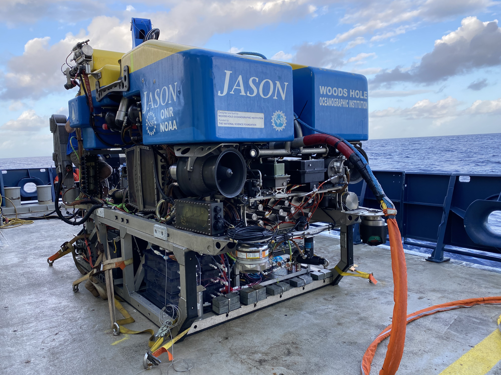
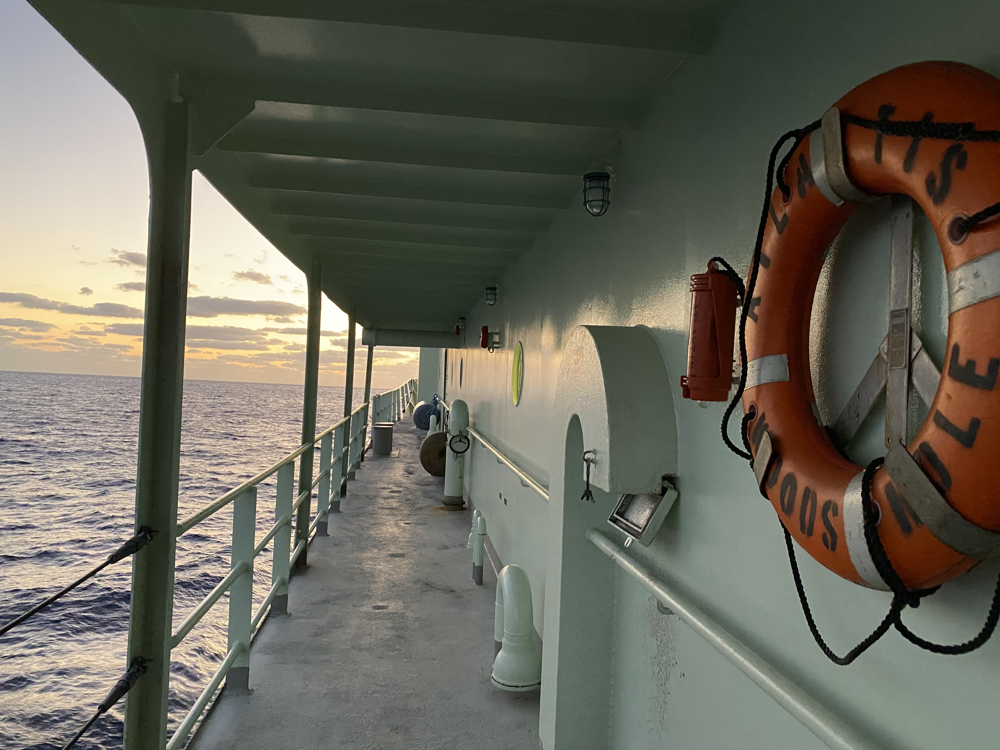
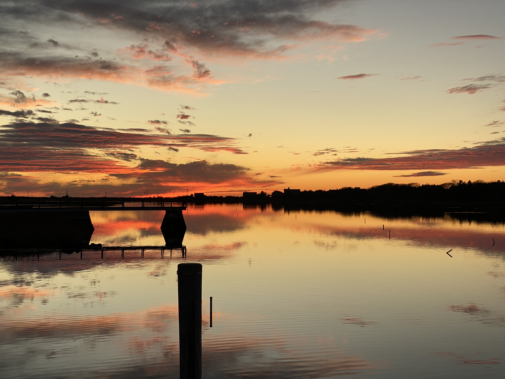

## Woods Hole Palettes


### Installation

R package is available for download through Github and devtools.
```
devtools::install_github("shu251/PaletteWoodsHole")
```


### Usage

```
library(PaletteWoodsHole)
```

To see all palette names available:
```
names(woodshole)
 # [1] "whoi"           "whoi2"          "jason"         
 # [4] "atlantis"       "wefa_sun"       "bikepath"      
 # [7] "bog"            "rocky_beach"    "eelpond_winter"
# [10] "tulips"         "sunset_winter" 
```

View colors in a grid:
```
show_color(bog)
```


### Color palettes

## Woods Hole Oceanographic Institution


```{r}
whoi <- c("#10B7BD","#12A8E0", "#0F6BB3","#FFFFFF")
whoi2 <- c("#FFFFFF","#0F6BB3","#D9F0F7", "#10B7BD","#B4DFED","#46A7CF")
```

## Jason
```{r, out.width = '20%'}

```

```{r, fig.height=4, fig.width=6}
jason <- c("#044F9A","#fec44f", "#5D86C3", "#fc4e2a", "#B6C8DB", "#2A394F")
scales::show_col(jason)
```

## Alvin
```{r}

```
```{r}

```


## Atlantis
```{r, out.width='30%'}

```


```{r}
atlantis <- c("#9DBABB","#1B334B","#CFBC9F",
              "#576F70","#091A2A","#301609",
              "#E0E5E5","#596873","#878A7E")
scales::show_col(atlantis)
```


## Woods Hole & Falmouth
### West Falmouth sunset
```{r sunset, echo=FALSE,  out.width = '40%'}

```

```{r, fig.height=4, fig.width=6}
wefa_sun <- c("#DDC794", "#B5623A", "#F95316","#584438",
              "#EEBA62","#8C3B25","#9B8E77","#917062")
scales::show_col(wefa_sun, ncol = 4)
```

### Shining Sea Bikeway

```{r figurename, echo=FALSE,  out.width = '40%'}

```

```{r, fig.height=7, fig.width=8}
bikepath <- c("#6C6865","#595E44","#869055","#E1DFEA","#313E1C","#D0D4DC","#BCB277")
scales::show_col(bikepath, ncol = 7)
```

### Cranberry Bog
```{r bog, echo=FALSE, out.width = '40%'}

```


```{r, fig.height=4, fig.width=6}
bog <- c("#AC7070","#D6D9DA", "#33291B","#C5C7C7", "#937771","#5A4A35")
scales::show_col(bog)
```

## Rocky beach


```{r, out.width= '30%'}

```


```{r}
rocky_beach <- c("#716347","#476AA7","#7299CE","#A2937A","#B2C9E3","#3D3019")
scales::show_col(rocky_beach)
```


## Eel pond - winter

```{r, out.width='30%'}

```


```{r}
eelpond_winter <- c("#E1E7ED","#C5C9CF","#353638",
                    "#6A7072","#AAAEB3","#ffffff")
scales::show_col(eelpond_winter)
```

## Spring

```{r, out.width='30%'}
knitr::include_graphics("images/spring.jpg")
```


```{r}
tulips <- c("#D77D36", "#E4BF62", "#79805E", 
            "#E2DBC7","#81A063","#fa9fb5",
            "#B24236","#fed976","#5A7356")
scales::show_col(tulips)
```

## Winter Sunset

```{r, out.width='30%'}

```


```{r}
sunset_winter <- c("#FDEAAB","#E9B27A","#A8B1BD","#B58975","#DBDBD2","#F6E7C1")
scales::show_col(sunset_winter)
```

